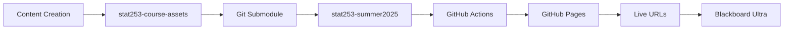

# STAT A253 Applied Statistics for the Sciences - Summer 2025

[](https://github.com/jjohnson-47/stat253-summer2025/actions/workflows/pages.yml)
[](https://github.com/jjohnson-47/stat253-summer2025/actions/workflows/ci.yml)

A comprehensive course repository for **STAT A253 Applied Statistics for the Sciences**, an asynchronous online statistics course using R programming. This repository provides a complete learning management system with interactive content, R assignments, and automated deployment workflows.

## 🎯 Project Overview

This is a **dual-repository architecture** designed for educational content management:

- **Private Repository** (`stat253-summer2025`) - Course development, assignments, documentation
- **Public Repository** (`stat253-course-assets`) - Interactive content served via GitHub Pages
- **Seamless Integration** - Submodule linking with automated deployment

## 📁 Repository Structure

```
stat253-summer2025/
├── assets/                           [📦 Git Submodule → stat253-course-assets]
│   ├── stat253/
│   │   ├── interactive/              [🌐 Interactive learning modules]
│   │   ├── images/                   [📊 Course visualizations]
│   │   └── r-code/                   [💻 Downloadable R scripts]
│   ├── probability-explorer/         [🎮 Advanced probability tool]
│   └── monty-hall-game/             [🎲 Classic probability game]
├── r-assignments/                    [📚 Production R assignments 1-5]
├── docs/                            [📖 Course documentation]
├── lms-blackboard/                  [🎓 Blackboard Ultra integration]
├── scripts/                         [🔧 Automation scripts]
├── visualizer/                      [🛠️ Development tools]
├── .github/workflows/               [⚙️ CI/CD automation]
└── iframe-embed-codes.html          [📋 Ready-to-use Blackboard codes]
```

## 🌐 Live Content URLs

All interactive content is hosted at: `https://jjohnson-47.github.io/stat253-summer2025/`

### 📚 Interactive Learning Modules
- **Week 3 Overview:** [`/stat253/interactive/week3-overview/`](https://jjohnson-47.github.io/stat253-summer2025/stat253/interactive/week3-overview/)
- **Section 3.1:** [`/stat253/interactive/section-3-1-overview/`](https://jjohnson-47.github.io/stat253-summer2025/stat253/interactive/section-3-1-overview/)
- **Section 3.2:** [`/stat253/interactive/section-3-2-overview/`](https://jjohnson-47.github.io/stat253-summer2025/stat253/interactive/section-3-2-overview/)
- **[...complete list in iframe-embed-codes.html]**

### 🎮 Interactive Tools
- **Probability Explorer:** [`/probability-explorer/`](https://jjohnson-47.github.io/stat253-summer2025/probability-explorer/)
- **Monty Hall Game:** [`/monty-hall-game/`](https://jjohnson-47.github.io/stat253-summer2025/monty-hall-game/)
- **Poker Break Game:** [`/stat253/interactive/poker-break/`](https://jjohnson-47.github.io/stat253-summer2025/stat253/interactive/poker-break/)

## 🚀 Quick Start for Developers

### Prerequisites
- Git with submodule support
- R (4.3.2+)
- Node.js (18+)
- GitHub CLI (optional but recommended)

### Setup
```bash
# Clone with submodules
git clone --recursive https://github.com/jjohnson-47/stat253-summer2025.git
cd stat253-summer2025

# Run automated setup
./setup.sh
```

The setup script will:
- ✅ Initialize submodules
- ✅ Install Node.js dependencies
- ✅ Install R dependencies (lintr, styler)
- ✅ Configure pre-commit hooks (if available)

## 📚 Content Creation Workflows

### 1. Interactive Learning Modules

**Location:** `assets/stat253/interactive/`

**Creation Process:**
1. Develop HTML content with interactive elements
2. Test locally using any web server
3. Commit to `stat253-course-assets` repository
4. Update submodule in main repository
5. Content automatically deploys via GitHub Actions

**Example Module Structure:**
```html
<!DOCTYPE html>
<html lang="en">
<head>
    <meta charset="UTF-8">
    <title>Section 3.1 - Probability Basics</title>
    <!-- MathJax for formulas -->
    <script src="https://polyfill.io/v3/polyfill.min.js?features=es6"></script>
    <script id="MathJax-script" async src="https://cdn.jsdelivr.net/npm/mathjax@3/es5/tex-mml-chtml.js"></script>
</head>
<body>
    <!-- Interactive content with CSS/JS -->
</body>
</html>
```

### 2. R Assignments

**Location:** `r-assignments/`

**Structure Per Assignment:**
```
01-r-assignment/
├── Assignment1.R                     # Main R script
├── Rassignment1-instructions.html    # Student instructions  
├── Rassignment1-assignment-submission.txt  # Submission guide
├── module-description.txt            # Assignment overview
└── data/                            # CSV datasets (if needed)
    ├── dataset1.csv
    └── dataset2.csv
```

**Development Process:**
1. Create R script with exercises and TODO comments
2. Write HTML instructions with examples
3. Test script execution: `Rscript r-assignments/01-r-assignment/Assignment1.R`
4. Validate with CI: Scripts are tested automatically on commit

### 3. Blackboard Ultra Integration

**Location:** `lms-blackboard/`

**Embedding Process:**
1. Open [`iframe-embed-codes.html`](./iframe-embed-codes.html) in browser
2. Find desired content section
3. Click "Copy Code" button
4. Paste iframe code into Blackboard Ultra content area
5. Adjust height if needed for your layout

**Package Creation:**
```bash
# Generate Blackboard packages
./scripts/build_blackboard_zip.sh

# Output: blackboard-packages/
├── blackboard-package-week2.zip
├── blackboard-package-week3.zip
└── blackboard-package-complete.zip
```

## ⚙️ Automated Workflows

### GitHub Actions Pipelines

#### 🚀 Deployment Pipeline (`.github/workflows/pages.yml`)
**Triggers:** Push to `main` branch
**Actions:**
- Checkout with recursive submodules
- Deploy `assets/` content to GitHub Pages
- Update live URLs automatically

#### 🔍 Quality Assurance (`.github/workflows/ci.yml`)
**Triggers:** Push/PR to `main`
**Checks:**
- ✅ R script syntax validation
- ✅ R code linting (lintr)
- ✅ Node.js build tests (visualizer)
- ✅ Markdown linting
- ✅ Submodule consistency

### Pre-commit Hooks (`.pre-commit-config.yaml`)
- Trailing whitespace removal
- R code linting
- Markdown validation
- Large file detection
- Submodule cleanliness checks

## 🎯 Content Management Best Practices

### Submodule Workflow
```bash
# Update interactive content
cd assets
git checkout main
git pull
# Make changes to content
git add .
git commit -m "Update section 3.1 interactive content"
git push

# Update main repository
cd ..
git add assets
git commit -m "Update assets submodule"
git push  # Triggers automatic deployment
```

### R Assignment Development
```bash
# Test assignment locally
Rscript r-assignments/01-r-assignment/Assignment1.R

# Lint R code
Rscript -e "lintr::lint('r-assignments/01-r-assignment/Assignment1.R')"

# Commit changes
git add r-assignments/01-r-assignment/
git commit -m "Update Assignment 1: Add new statistical examples"
```

### Content Validation
```bash
# Run full test suite
npm test --prefix visualizer

# Check all R scripts
./scripts/validate-r-scripts.sh  # (if exists)

# Validate markdown documentation
markdownlint docs/**/*.md
```

## 📊 Architecture Deep Dive

### Dual-Repository Pattern

**Why This Architecture?**
- 🔒 **Security**: Sensitive course materials remain private
- 🌐 **Performance**: Public assets served via CDN (GitHub Pages)
- 🔄 **Automation**: Changes deploy automatically
- 📱 **Accessibility**: Content works on all devices

**Content Flow:**


### Technology Stack

**Frontend:**
- 📝 HTML5/CSS3 - Interactive learning modules
- 🧮 JavaScript - Probability simulations
- 📐 MathJax - Mathematical formula rendering
- 🎨 CSS Grid/Flexbox - Responsive layouts

**Backend/Development:**
- 📊 R - Statistical computing and analysis
- 🔧 TypeScript/Vite - Development tooling (visualizer)
- 🧪 Jest - JavaScript testing
- ⚙️ GitHub Actions - CI/CD automation

**Deployment:**
- 🌐 GitHub Pages - Static site hosting
- 📦 Git Submodules - Asset management
- 🎓 Blackboard Ultra - LMS integration

## 🛠️ Development Tools

### Available Scripts

```bash
# Development environment setup
./setup.sh

# Blackboard package generation
./scripts/build_blackboard_zip.sh

# Visualizer development (TypeScript tool)
cd visualizer
npm run dev      # Development server
npm run build    # Production build
npm test         # Run tests
```

### IDE Configuration

**Recommended VS Code Extensions:**
- R Extension for Visual Studio Code
- ESLint
- Prettier
- markdownlint

## 📋 Maintenance and Updates

### Regular Tasks

**Weekly:**
- Update submodule to latest content
- Review and merge development branches
- Check GitHub Actions status

**Monthly:**
- Update R and Node.js dependencies
- Review and update documentation
- Audit content for accessibility

**Semester:**
- Archive previous semester branches
- Update course schedule and deadlines
- Refresh assignment datasets

### Troubleshooting

**Common Issues:**

1. **Submodule Not Updating:**
   ```bash
   git submodule update --remote assets
   git add assets
   git commit -m "Update assets to latest"
   ```

2. **GitHub Pages 404 Errors:**
   - Check GitHub Pages settings (Settings → Pages → Source: "GitHub Actions")
   - Verify submodule URLs use HTTPS not SSH
   - Confirm workflow completed successfully

3. **R Script Failures:**
   - Check working directory: scripts expect to run from repository root
   - Verify CSV files exist in assignment data directories
   - Install missing R packages

## 🤝 Contributing

### For Course Staff

1. **Content Updates:** Work in `assets/` submodule for public content
2. **Assignment Development:** Use `r-assignments/` for course materials
3. **Documentation:** Update relevant files in `docs/`

### For Developers

1. Fork the repository
2. Create feature branch: `git checkout -b feature/new-content`
3. Make changes following the style guides
4. Run tests: `npm test --prefix visualizer`
5. Submit pull request

### Commit Message Format
```
<type>: <description>

Examples:
feat: Add section 3.4 interactive probability calculator
fix: Resolve CSV loading issue in Assignment 2
docs: Update README with deployment instructions
style: Format R code according to tidyverse guidelines
```

## 📚 Additional Resources

- **[Project Structure Guide](./PROJECT-STRUCTURE.md)** - Detailed directory documentation
- **[iframe Embed Codes](./iframe-embed-codes.html)** - Ready-to-use Blackboard codes
- **[Cleanup Documentation](./clean-up.md)** - Repository optimization process
- **[Post-Cleanup Audit](./post_cleanup_audit.txt)** - Implementation status

## 📞 Support

For technical issues:
1. Check [GitHub Issues](https://github.com/jjohnson-47/stat253-summer2025/issues)
2. Review workflow logs: `gh run list`
3. Validate local setup: `./setup.sh`

For course content questions:
- Review documentation in `docs/`
- Check assignment instructions in `r-assignments/`

---

## 📈 Course Information

**Course:** STAT A253 Applied Statistics for the Sciences  
**Format:** Asynchronous online learning  
**Duration:** 10-week summer intensive  
**Technology:** R programming with interactive web content

**Learning Objectives:**
- 📊 Descriptive Statistics (Chapter 2)
- 🎲 Probability Theory (Chapter 3)  
- 💻 R Programming skills
- 🔬 Applied statistical problem solving

---

*This documentation reflects the current architecture as of Summer 2025. For technical questions about the repository structure, see PROJECT-STRUCTURE.md or the cleanup audit documentation.*